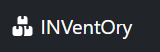
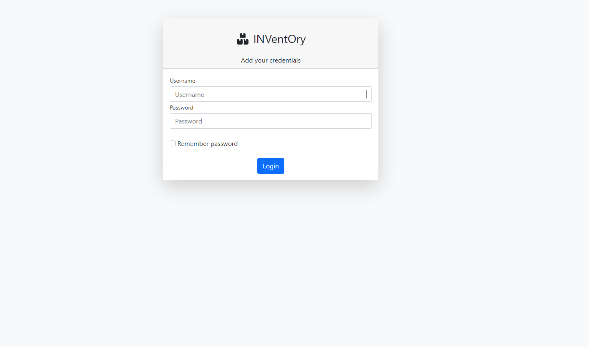
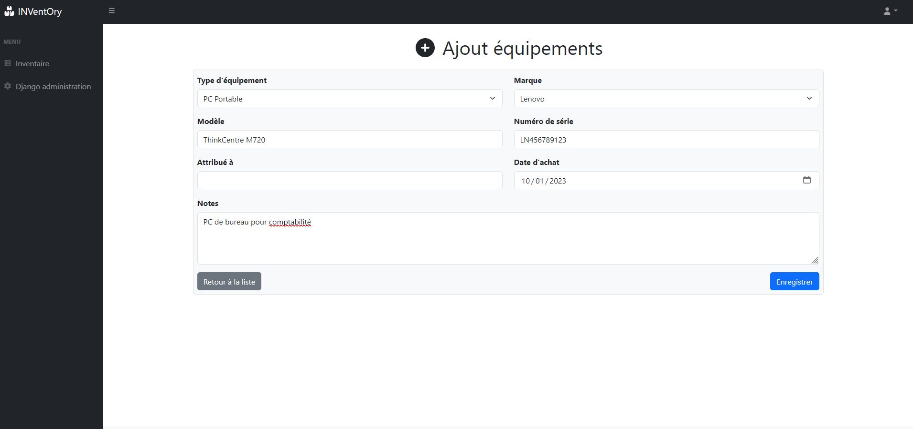
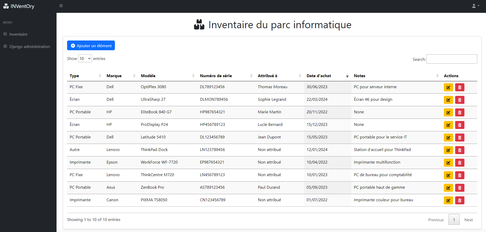
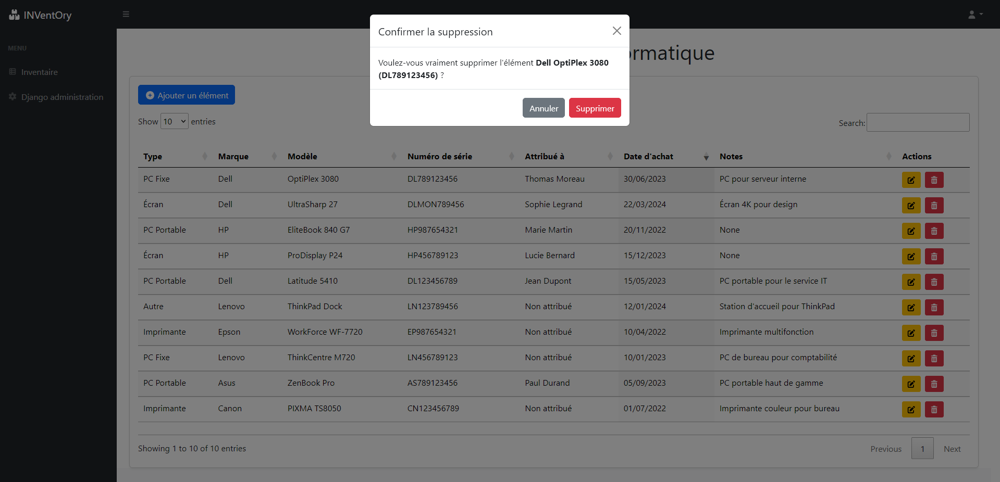
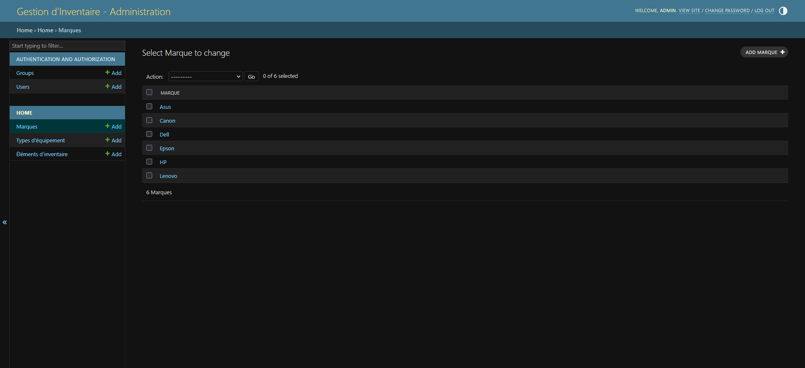

# 
INVentOry est une application web simple de gestion d'inventaire pour un parc informatique, 
développée avec **Django 5.2.7**. Elle permet de gérer un inventaire d'équipements (PC portables, PC fixes, écrans, imprimantes, etc.) 
avec des fonctionnalités CRUD (Créer, Lire, Mettre à jour, Supprimer). 
L'interface utilise **Bootstrap 5.3** pour un design moderne et responsive, 
**DataTables 1.13.4** pour l'affichage des données.


## Fonctionnalités
- Ajout et modification d'équipements via un formulaire stylé avec Bootstrap.
- Affichage des équipements dans un tableau interactif avec tri, recherche et pagination via DataTables.
- Suppression d'équipements avec confirmation via un modal Bootstrap.
- Gestion des types d'équipements et des marques via l'interface d'administration Django.
- Fixture JSON pour préremplir la base de données avec des données d'exemple.

## Technologies utilisées
- **Python 3.12** : Langage de programmation.
- **Django 5.2.7** : Framework web pour le backend.
- **SB Admin - Django Dashboard** : https://github.com/startbootstrap/startbootstrap-sb-admin-2
- **Bootstrap 5.3** : Framework CSS pour le design responsive.
- **jQuery 3.6.0** : Bibliothèque JavaScript pour DataTables et interactions.
- **DataTables 1.13.4** : Bibliothèque pour les tableaux interactifs.
- **Font Awesome 6.4.0** : Icônes pour les boutons d'action.


## Structure du projet
- **Apps** :
  - `authentication` : Gestion des utilisateurs.
  - `home` : Application principale pour la gestion de l'inventaire.
- **Base de données** : SQLite (par défaut avec Django).
- **Templates** : Formulaires et tableaux stylés avec Bootstrap.
- **Fixtures** : Données initiales dans `apps/home/fixtures/inventory_fixtures.json`.

## Captures d'écran

### 1 : Page authentification
 

### 2 : Formulaire d'ajout
 

### 3 : Liste des équipements
 

### 4 : Modal de confirmation de suppression
 

### 5 : Interface django admin
 

## Prérequis
- Python 3.12
- pip (pour installer les dépendances)
- Un navigateur web pour l'interface utilisateur

## Installation
1. **Cloner le dépôt** :
   ```bash
   git clone https://github.com/elreviae/django-inventory.git
   cd django-inventory
   
2. **Créer un environnement virtuel (Windows)** :
    ```bash
    python -m venv venv
    venv\Scripts\activate.ps1

3. **Installation des requirements** :
    ```bash
    pip install -r requirements.txt

4. **Appliquer les migrations** :
    ```bash
    python manage.py makemigrations
    python manage.py migrate

5. **Charger les données initiales avec fixture** :
    ```bash
    python manage.py loaddata inventory_fixtures
   
6. **Créer un superutilisateur pour l'admin** :
    ```bash
    python manage.py createsuperuser

7. **Lancer le serveur** :
    ```bash
    python manage.py runserver

* Interface principale : http://127.0.0.1:8000/
* Interface d'administration : http://127.0.0.1:8000/config/
